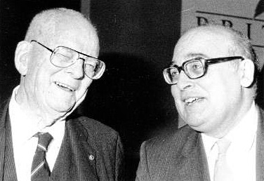
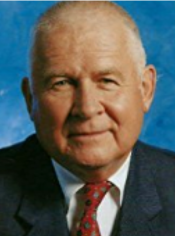
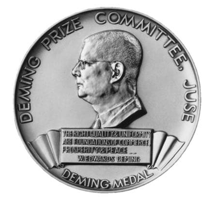
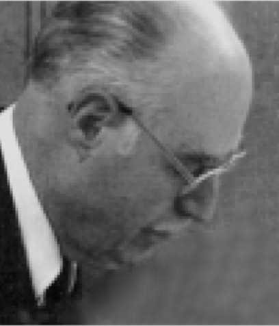
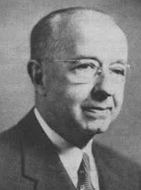

# Day 1: The "Overture" and the Deming Story {.unnumbered}


```{r message=FALSE, warning=FALSE}
#| echo: false

source(here::here("R/functions.R"))
```

:::: {.columns}

::: {.column width="90%"}
## Day 1 (morning): The "Overture"
:::

::: {.column width="10%"}
<div style="margin-top: 10px">
```{r, echo=FALSE, message=FALSE, warning=FALSE}
create_clock(9, 30)
```
</div>

:::

::::

{.lightbox}

Why an “Overture” rather than an “Introduction”? Simply because this half-day contains much more than
you would expect in a mere introduction to this structured active-learning course on the approach to management developed by Dr W Edwards Deming—pictured above left (aged 88) with me in 1989[^a] (*Such superscript letters as a refer to the “Approvals, Acknowledgements and Information” at the end of the file.*)

Continuing the musical analogy, let’s suppose you’ve arranged an evening out at a theatre to enjoy some
kind of musical production. Perhaps it’s a light modern musical or musical comedy; at the other extreme,
maybe it’s grand opera! In past centuries, overtures were often regarded as no more than background
music while the audience ambled in. These days, the overture is usually treated with greater respect, and
rightly so. It sets the scene by including several of the main themes from the show, and gives some tasters
of the moods and style of what is to follow. Now, it might just happen that you take such an instant dislike
to those snippets that you decide to leave the theatre straightaway and spend the evening some other way
—which, seeing the price of theatre tickets nowadays, could be a rather expensive decision! Hopefully
though, you will instead like what you are hearing, and settle down to enjoy the show and have a very pleasant evening. But at least you will have had some prior warning in case the show is just not “your thing”.

This Overture performs a similar function. It does indeed expose you to an initial “feel” of what is to follow,
of both the nature and some of the content of the Deming approach itself and of the style of this course in
the way it can help you to learn about it. And that is both sensible and necessary. One section of this
Overture is headed “Deming is different”. Yes indeed, *very* different compared with other approaches to
management, to quality, to people—so different that it honestly might not be to your taste. If that is the
case then I don’t want to waste your time—that won’t be of any benefit to either you or me. So if, having
“heard” the Overture, you really feel this is not for you then you can indeed decide to leave the theatre
straightaway and, in this case, you will only have wasted a little time, not a lot of money! Otherwise, please
stay and enjoy. Maybe, before long, you’ll find yourself climbing out of the audience to join those on the
stage!


## Deming (Re)Discovered

### The Deming Prize and the Nashua Corporation

:::: {.columns}

::: {.column width="70%"}
In the 1970s, a medium-sized American company, the Nashua Corporation, was
an agent for copying machines made by Ricoh, the well-known Japanese manufacturer. In 1974, Ricoh was awarded Japan’s Deming Prize. The people at
Nashua, including Chief Executive William E Conway, did not know who or what
“Deming” was. All they knew was that the illustrious and eagerly-sought Deming
Prize was Japan’s best-known award for quality, and had been set up as long ago
as 1950 by JUSE, the Japanese Union of Scientists and Engineers.
:::

::: {.column width="5%"}

:::

::: {.column width="25%"}
{.lightbox}

:::

::::

{width=50% .lightbox}

The inscription near the bottom of the medal[^b] is a quotation from Dr Deming:

><span class=deming_quote>“The right quality and uniformity are foundations of commerce, prosperity and peace.”</span>

<span class=neave_note>NB Throughout this course, exact quotations from Dr Deming are printed in blue in order to set them apart from my own writing. His own quotations are especially valuable in that he had the rare ability of being able to say a very great deal in remarkably few words. I wouldn’t want to mislead you into thinking that I am capable of the same degree of either brevity or wisdom!</span>

:::: {.columns}

::: {.column width="70%"}

Almost five more years passed before Bill Conway discovered that this “Deming” was in fact an American,
Dr W Edwards Deming who, although already in his late 70s, was still actively
teaching and consulting, mostly in what he described as “statistical studies”.

Bill contacted Dr Deming and had several discussions with him—discussions
concerning events ranging over the previous 30 and more years, the content of
which Bill found extraordinary and initially almost unbelievable. Eventually, Bill
persuaded Dr Deming to become a consultant for Nashua—although I suggest
a “teacher” would have been a better description.

:::

::: {.column width="5%"}

:::

::: {.column width="25%"}
{.lightbox}
:::

::::

One of Dr Deming’s first recommendations was that Nashua acquire the services of an experienced statistician. On Deming’s advice, Bill “head-hunted”
Dr Lloyd S Nelson, who at that time had been working in the General Electric
Company for almost 30 years. That choice was particularly fortuitous for me
because, although we had never met, I had been in correspondence with Lloyd for several years, particularly in connection with the *Journal of Quality Technology* which he had founded in
1970. A short while after moving to Nashua, Lloyd contacted me to ask if I would be interested in getting
involved with Nashua’s British subsidiaries. I accepted the invitation.

:::: {.columns}

::: {.column width="70%"}
My main initial task was to help set up and supervise a company-wide
training scheme, mostly on some of what are often referred to as the “old
tools” or “seven tools” of quality. Lloyd’s syllabus included the Ishikawa
diagram (“fishbone” chart), the Pareto chart, flowcharting, brainstorming,
and an all-important statistical tool invented by Dr Walter A Shewhart in
1924: the *control chart*. Don’t worry if you haven’t heard of some or all of
these since the control chart is the *only* such “tool” to be studied in any
detail and used in this course. And, even there, anything beyond the
basics will just be “optional extras” for those who are really interested in
them. Later today we shall also see an extremely important illustration
which Deming referred to as a “flow diagram”, but that’s not quite the
same as what most people mean by “flowcharting”.
:::

::: {.column width="5%"}

:::

::: {.column width="25%"}
{.lightbox}
:::

::::

### The four-day seminars

I had no communication with Dr Deming himself during that time. I did, of course, hear more and more
about him. One of the things I heard was that the people at Nashua Corporation had encouraged him to
prepare and present a public seminar on his work. That seemed reasonable enough to me, but what
astonished me was the length of the seminar: four days. *Four days*? In the university at which I was then
teaching Mathematical Statistics, I was more used to seminars lasting an hour at most—and often that
seemed too long! But the four-day seminars were clearly successful, and were soon being presented at
least once a month. Audiences, which naturally had initially been quite small, were soon being counted in
several hundreds at a time.

Then in 1982 a friend at Nashua here in the UK gave me a copy of the mimeographed book which Dr Deming was now issuing to all the delegates at his seminars. It was called *Quality, Productivity, and Competitive Position*—the same title that was often used at that time for his seminars. It was through this book that
I began to discover Dr Deming’s work involved far more than just Statistics!

My first direct contact with Dr Deming came in 1985, and in a wholly unexpected and very privileged fashion. In the Spring of that year, out of the blue I received a letter from a senior official of the George Washington University which, at that time, was administering the four-day seminars. The letter said that Dr Deming was coming to London that summer to present his four-day seminar in Britain for the first time, and had
requested that I be invited to assist him at that seminar.

The London four-day seminars became an annual event from 1985 to 1991 inclusive, and I had the same
privilege of working with Dr Deming as his assistant at all of those seminars. I was also involved with him in
many other events, both in this country and elsewhere, for the rest of his life. The last time I was with him
was at his final four-day seminar in Europe, held in Zurich in July 1993, just five months before he died.

:::: {.columns}

::: {.column width="90%"}
I’ll briefly describe the style of the four-day seminars for you. Basically, except for the breaks, Dr Deming
spoke from 9.00 to 4.00 each day (except for finishing a little earlier on the final day so that the delegates
could get back home). Then the delegates would split into Working Groups to deliberate, often long into
the evening, on a choice from a large selection of topics and questions that Dr Deming had compiled. This
is where assistants like myself would be busy helping the Working Groups, and then later designing and
organising a programme of feedback from the Groups to be presented the following morning for the hour
before Dr Deming resumed his teaching. However, he was always there: watching, listening, learning.
:::

::: {.column width="10%"}
<div style="margin-top: 170px">
```{r, echo=FALSE, message=FALSE, warning=FALSE}
create_clock(9, 40)
```
</div>

:::

::::

### The British Deming Association and later

Not surprisingly, I soon began to present my own seminars on Dr Deming’s work and, largely with the help
of people that I met at those early seminars and at the London four-day seminars, encouraged the formation of the British Deming Association in 1987. The BDA was a not-for-profit educational organisation having the aims of spreading awareness and aiding understanding of the Deming management philosophy.


[^a]: Photo by courtesy of SPC Press Inc.
[^b]: Copyright© Deming Prize Committee. All Rights Reserved. <http://www.juse.or.jp/deming_en/>